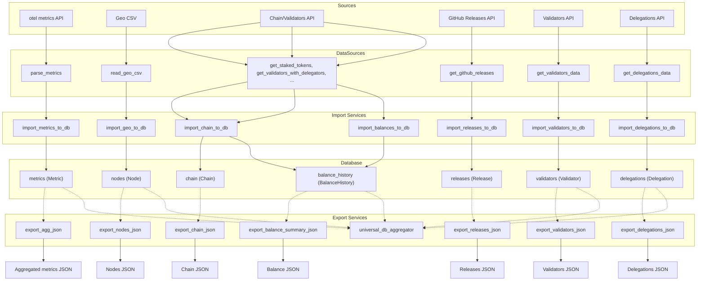
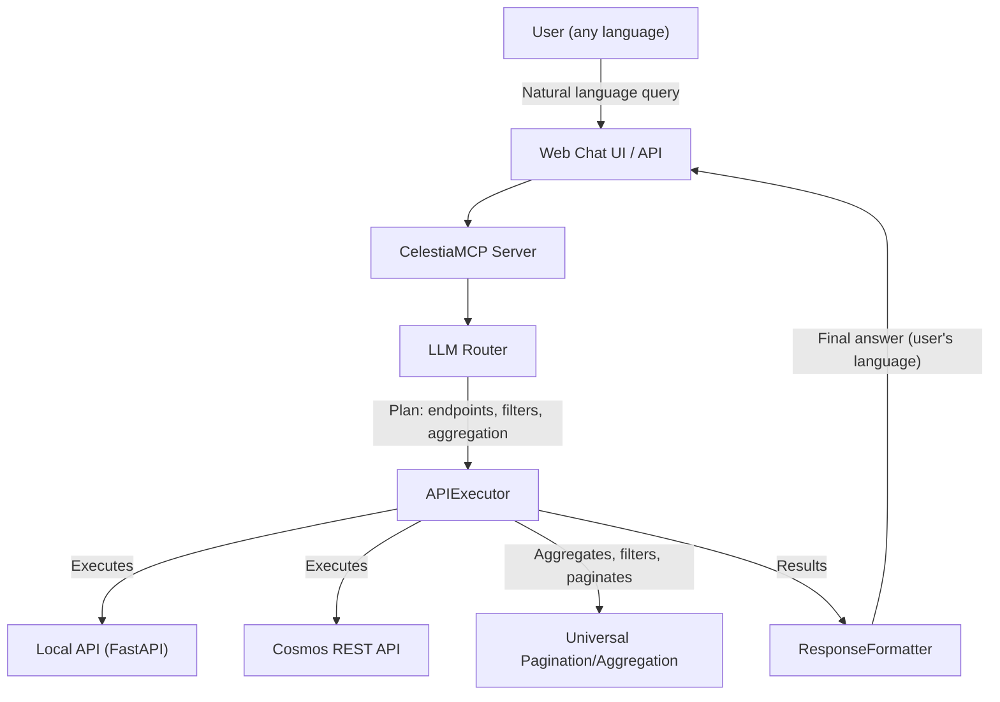

# CelestiaBridge

## Project Description

CelestiaBridge is a modular backend platform for collecting, processing, aggregating, and exporting analytical data about the Celestia network. The system automatically gathers metrics from various sources (otel metrics, APIs, CSV, GitHub), normalizes and stores them in a structured database, and provides a unified CLI for import, export, and analytics. The main goal is to provide a single point of data collection and preparation for dashboards, monitoring, research, and analytics automation for Celestia.

**Key Features:**
- Collects metrics from otel metrics, APIs, CSV, GitHub Releases
- Validator and delegation data collection and analysis
- Advanced filtering and analytics capabilities
- Unified pipeline for data processing and normalization
- Stores data in a structured database (PostgreSQL/SQLite)
- Aggregation and export to JSON for dashboards/BI/analytics
- Multilingual support
- Real-time data analysis through natural language queries
- Convenient CLI for import, export, and data viewing
- Flexible configuration via `.env` and `config/`
- Modular, clean, and testable codebase
- All docstrings and comments are in English
- All dependencies are managed via `requirements.txt`
- All error handling via try/except and logging
- All data models are in `models/`

**Intended Users:**
- Developers, analysts, DevOps, Celestia dashboard operators
- Anyone who needs to automatically collect, store, and analyze Celestia network data

---

## Quick Start

1. Create and activate a virtual environment:
   ```bash
   python -m venv venv
   source venv/bin/activate  # or venv\Scripts\activate for Windows
   ```
2. Install dependencies:
   ```bash
   pip install -r requirements.txt
   ```
3. Configure environment variables in `.env` file as needed.

### CLI

```bash
python main.py --help
```

---

## CLI Usage

CelestiaBridge provides a unified CLI for importing, exporting, and viewing data. All commands are run as:

```bash
python main.py <command> [options]
```

### CLI Command Reference

- **init_db** — Initialize the database and create all required tables.
  - Example: `python main.py init_db`

- **import_geo** — Import geo-csv into the `nodes` table (updates node geoinfo).
  - Example: `python main.py import_geo`

- **import_metrics** — Import otel metrics into the `metrics` table.
  - Example: `python main.py import_metrics`

- **import_chain** — Import chain metrics (stake, delegators, inflation, etc.) into the `chain` table.
  - Example: `python main.py import_chain`

- **import_releases** — Import releases from GitHub into the `releases` table.
  - Example: `python main.py import_releases`

- **import_balances** — Import wallet balances from Cosmos API into the `balance_history` table.
  - Example: `python main.py import_balances`

- **import_validators** — Import validator data from Cosmos API into the `validators` table.
  - Example: `python main.py import_validators`

- **import_delegations** — Import delegation data from Cosmos API into the `delegations` table.
  - Example: `python main.py import_delegations`

- **show_table <table>** — Show the first 10 records from the selected table (`nodes`, `metrics`, `chain`, `releases`, `balance_history`, `validators`, `delegations`).
  - Example: `python main.py show_table nodes`

- **export_agg <metric_name> [--hours N] [--out FILE]** — Export an aggregated metric (e.g., latency) for the specified period to JSON.
  - Example: `python main.py export_agg latency --hours 48 --out latency_agg.json`

- **export_releases [--out FILE]** — Export all releases to JSON.
  - Example: `python main.py export_releases --out releases.json`

- **export_chain [--out FILE] [--limit N]** — Export chain metrics to JSON (legacy format).
  - Example: `python main.py export_chain --out chain.json --limit 50`

- **export_nodes [--out FILE]** — Export all nodes to JSON.
  - Example: `python main.py export_nodes --out nodes.json`

- **export_balances [--out FILE]** — Export balance data to JSON.
  - Example: `python main.py export_balances --out balances.json`

- **export_validators [--out FILE]** — Export validator data to JSON.
  - Example: `python main.py export_validators --out validators.json`

- **export_delegations [--out FILE]** — Export delegation data to JSON.
  - Example: `python main.py export_delegations --out delegations.json`

#### Help
To see all available commands and options:
```bash
python main.py --help
python main.py <command> --help
```

---

## Project Structure

- `api_main.py` — FastAPI web server with REST API endpoints
- `main.py` — CLI entry point with import/export commands
- `config.py` — Main configuration file (API URLs, database settings, LLM settings)
- `check_db.py` — Database utility for checking table contents
- `requirements.txt` — Python dependencies
- `README.md` — Project documentation
- `LICENSE` — MIT License

- `data_sources/` — Modules for reading/parsing raw data
  - `api.py` — Cosmos REST API client
  - `geo_csv.py` — Geo CSV data parser
  - `otel.py` — OpenTelemetry metrics parser
  - `peers_geo_mainnet_latest.csv` — Geo data for network nodes

- `models/` — SQLAlchemy data models
  - `base.py` — Base model class
  - `node.py` — Network nodes model (`Node`)
  - `chain.py` — Chain metrics model (`Chain`)
  - `metric.py` — Time-series metrics model (`Metric`)
  - `release.py` — GitHub releases model (`Release`)
  - `balance.py` — Wallet balances model (`BalanceHistory`)
  - `validator.py` — Validator model (`Validator`)
  - `delegation.py` — Delegation model (`Delegation`)

- `services/` — Business logic, integration, data processing
  - `db.py` — Database connection and initialization
  - `universal_db_aggregator.py` — Universal database aggregator for any SQLAlchemy model
  - `paginated_aggregator.py` — Cosmos API pagination aggregator
  - `cosmos_api.py` — Cosmos blockchain API integration
  - `balance_import.py` — Wallet balance import from Cosmos API
  - `balance_export.py` — Wallet balance export and analytics
  - `chain_import.py` — Chain metrics import
  - `chain_export.py` — Chain metrics export
  - `metrics_import.py` — Prometheus metrics import
  - `metrics_agg.py` — Metrics aggregation and export
  - `node_export.py` — Network nodes export
  - `geo_import.py` — Geographic data import
  - `releases_import.py` — GitHub releases import
  - `releases_export.py` — GitHub releases export
  - `validator_import.py` — Validator data import
  - `validator_export.py` — Validator data export
  - `delegation_import.py` — Delegation data import
  - `delegation_export.py` — Delegation data export
  - `filter_builder.py` — Universal filter builder

- `celestia_mcp/` — AI Assistant (MCP) system
  - `mcp_server.py` — Main MCP server class
  - `web_chat_api.py` — FastAPI web chat interface
  - `gemini_llm_client.py` — Google Gemini LLM integration
  - `grok_llm_client.py` — Grok LLM integration
  - `core/` — Core MCP components
    - `api_executor.py` — API execution engine
    - `api_registry.py` — Endpoint discovery and registry
    - `llm_router.py` — LLM routing and query planning
    - `response_formatter.py` — Response formatting and localization

- `utils/` — Utility modules
  - `decorators.py` — API decorators for filters and validation
  - `endpoint_helpers.py` — Endpoint helper functions

- `filter_configs/` — Filter configurations
  - `filter_configs.py` — Universal filter configurations for all endpoints

---

## Database Tables Structure

The database contains the following tables, each corresponding to a SQLAlchemy model:

- **nodes** (`Node` model): Network nodes information including geo-location, IP addresses, and metadata
- **metrics** (`Metric` model): Time-series metrics collected from OpenTelemetry and other sources
- **chain** (`Chain` model): Chain-level metrics including stake, delegators, inflation, and block information
- **releases** (`Release` model): GitHub release data for Celestia software versions
- **balance_history** (`BalanceHistory` model): Historical wallet balances with delta storage (only changes are saved)
- **validators** (`Validator` model): Validator information including staking data, commission rates, uptime metrics
- **delegations** (`Delegation` model): Historical delegation data with delta storage for efficient tracking

### Model Relationships
- All models inherit from `Base` (SQLAlchemy declarative base)
- Models are designed for independent operation with minimal relationships
- Each model can be queried independently using the universal aggregator

### Database Utility: check_db.py

The `check_db.py` utility prints the list of tables in the current database and shows the number of records in each main table (`nodes`, `metrics`, `chain`, `releases`, `balance_history`, `validators`, `delegations`).

**Usage:**
```bash
python check_db.py
```

### Universal Database Aggregator

The `services/universal_db_aggregator.py` provides a powerful, unified interface for querying any database table with advanced features:

**Key Features:**
- **Universal**: Works with any SQLAlchemy model
- **Filtering**: Support for complex filters with operators (`eq`, `ne`, `gt`, `gte`, `lt`, `lte`, `like`, `in`, `is_null`)
- **Grouping**: Group results by any field(s)
- **Aggregation**: Count, sum, average, min, max operations
- **Sorting**: Sort by any field in ascending or descending order
- **Pagination**: Built-in skip/limit support
- **Multiple Return Formats**: `list`, `aggregated`, `count_only`

**Usage Example:**
```python
from services.universal_db_aggregator import aggregate_db_data
from models.node import Node

# Simple list with pagination
result = aggregate_db_data(Node, limit=100)

# Complex query with filtering, grouping, and aggregation
result = aggregate_db_data(
    Node,
    filters={"country": "DE", "region": "Europe"},
    group_by=["country", "region"],
    aggregations=[
        {"type": "count"},
        {"type": "sum", "field": "lat"},
        {"type": "avg", "field": "lon"}
    ],
    order_by={"count": "desc"},
    return_format="aggregated"
)
```

**API Integration:**
The aggregator is used by multiple API endpoints to provide consistent, powerful querying capabilities:
- `/nodes` endpoint uses `Node` model
- `/balances` endpoint uses `BalanceHistory` model  
- `/validators` endpoint uses `Validator` model
- `/delegations` endpoint uses `Delegation` model
- `/metrics/aggregate` endpoint uses `Metric` model

Other endpoints (`/chain`, `/releases`) use legacy export functions for backward compatibility.

---

## Data Flow Diagram



---

## Architectural Principles

- All logic for reading, parsing, and normalizing raw data (OpenTelemetry metrics, CSV, APIs) is in `data_sources/`.
- All parsers have a unified interface: return `list[dict]` or `dict`, handle errors via try/except and logging.
- No hardcoded paths, keys, or constants — everything is managed via `config.py` and environment variables.
- All business logic, aggregation, and integration is in `services/`.
- All data models (`Node`, `Chain`, `Metric`, `Release`, `BalanceHistory`, `Validator`, `Delegation`) are in `models/`.
- All models inherit from `Base` and are designed for independent operation.
- All database queries use the universal aggregator (`services/universal_db_aggregator.py`) for consistency and power.
- All API endpoints provide advanced filtering, grouping, aggregation, and sorting capabilities.
- Advanced filter system with universal filter builder and decorators for consistent API behavior.
- All dependencies are managed only via `requirements.txt`.
- All documentation and docstrings are in English.
- All error handling is performed via try/except and logging. Critical errors are logged but do not crash the pipeline (except for unrecoverable network errors).
- All configuration is handled via `.env` and `config.py`.
- The codebase is modular, clean, and testable.

---

## Error Handling & Logging

- All data reading/parsing functions in `data_sources/` use try/except and log errors, warnings, and info using the standard `logging` module.
- All critical errors are logged. The pipeline continues unless an unrecoverable error occurs (e.g., network fetch failure).
- No hardcoded variables; all configuration is via `.env` and `config.py`.

---

## Dependencies

All dependencies are managed via `requirements.txt`. Main dependencies include:
- SQLAlchemy (database ORM with declarative base)
- FastAPI (web framework for REST API)
- uvicorn (ASGI server for FastAPI)
- requests (HTTP client for external APIs)
- httpx (async HTTP client for MCP)
- python-dotenv (environment variables management)
- pycountry (country data and conversion)
- pandas (data manipulation and analysis)
- pydantic (data validation and serialization)
- click (CLI framework for command-line interface)
- pytest (testing framework)
- logging (standard library for error handling)

---

## Usage Scenario

**Example:**
A DevOps engineer wants to automate the collection and aggregation of Celestia network metrics for a dashboard. They configure `.env`, run `python main.py import_metrics` and `python main.py export_agg latency --hours 24 --out latency.json`, and use the resulting JSON in their dashboard.

**Advanced Example:**
An analyst wants to analyze wallet distribution by country. They use the API: `GET /balances?group_by=country&aggregations=[{"type":"count"},{"type":"sum","field":"balance_tia"}]&return_format=aggregated` to get aggregated balance statistics grouped by country.

**Validator Analysis Example:**
A researcher wants to analyze validator performance. They use: `GET /validators?group_by=status&aggregations=[{"type":"count"},{"type":"avg","field":"uptime_percent"}]&return_format=aggregated` to get validator statistics by status.

**Delegation Analysis Example:**
An analyst wants to find top delegators. They use: `GET /delegations?group_by=delegator_address&aggregations=[{"type":"sum","field":"amount_tia"}]&order_by=sum_amount_tia&order_direction=desc&limit=20` to get top delegators by total amount.

**Model Usage Example:**
A developer wants to query network nodes by region. They use the universal aggregator with the `Node` model: `GET /nodes?group_by=region&aggregations=[{"type":"count"}]&return_format=aggregated` to get node counts per region.

---

## API (FastAPI)

CelestiaBridge provides an open HTTP API to access all output data in JSON format.

### API Launch

#### Manual Launch
1. Install dependencies:
   ```bash
   pip install -r requirements.txt
   ```
2. Start the server:
   ```bash
   uvicorn api_main:app --reload --port 8002
   ```
   The API will be available at http://127.0.0.1:8002

#### Service Launch (Production)

1. Create systemd service file:
   ```bash
   sudo nano /etc/systemd/system/celestia-api-main.service
   ```

2. Add the following content (replace `YOUR_USERNAME` and `YOUR_PROJECT_PATH` with your actual values):
   ```ini
   [Unit]
   Description=Celestia Bridge Explorer API Main
   After=network.target

   [Service]
   Type=simple
   User=YOUR_USERNAME
   Group=YOUR_USERNAME
   WorkingDirectory=YOUR_PROJECT_PATH
   Environment=PATH=YOUR_PROJECT_PATH/venv/bin:/usr/local/bin:/usr/bin:/bin
   Environment=PYTHONPATH=YOUR_PROJECT_PATH
   ExecStart=YOUR_PROJECT_PATH/venv/bin/python YOUR_PROJECT_PATH/api_main.py
   Restart=always
   RestartSec=10

   [Install]
   WantedBy=multi-user.target
   ```

3. Enable and start the service:
   ```bash
   # Reload systemd configuration
   sudo systemctl daemon-reload
   
   # Enable auto-start on boot
   sudo systemctl enable celestia-api-main.service
   
   # Start the service
   sudo systemctl start celestia-api-main.service
   ```

4. Service management commands:
   ```bash
   # Check service status
   sudo systemctl status celestia-api-main.service
   
   # View service logs
   sudo journalctl -u celestia-api-main.service -f
   
   # Restart service
   sudo systemctl restart celestia-api-main.service
   
   # Stop service
   sudo systemctl stop celestia-api-main.service
   
   # View recent logs
   sudo journalctl -u celestia-api-main.service --since "1 hour ago"
   ```

5. Verify the API is running:
   ```bash
   # Check if port 8002 is listening
   sudo netstat -tlnp | grep :8002
   
   # Test API endpoint
   curl http://localhost:8002/health
   ```

The API will be available at http://localhost:8002

### Documentation
- Swagger UI: http://localhost:8002/docs
- OpenAPI JSON: http://localhost:8002/openapi.json

### Main Endpoints
- `GET /` — API health check
- `GET /nodes` — list of nodes with advanced filtering, grouping, and aggregation
- `GET /chain` — chain metrics (with pagination)
- `GET /metrics/aggregate?metric_name=...&hours=...` — aggregated metrics
- `GET /releases` — releases (with pagination)
- `GET /balances` — universal balance endpoint with filtering, grouping, and aggregation
- `GET /validators` — validator data with advanced filtering, grouping, and aggregation
- `GET /delegations` — delegation data with advanced filtering, grouping, and aggregation
- `GET /health` — API health check

#### Pagination Parameters
- `skip` — how many records to skip (default: 0)
- `limit` — how many records to return (default: 100, max: 1000)

#### Advanced Filtering and Aggregation

**Nodes Endpoint (`/nodes`):**
- Filter by: `country`, `region`, `city`, `org`
- Group by: any field (e.g., `country,region`)
- Aggregations: `count`, `sum`, `avg`, `min`, `max`
- Sort by: any field with `order_by` and `order_direction`

**Balances Endpoint (`/balances`):**
- Filter by: `target_date`, `min_balance`, `max_balance`, `address`
- Group by: `date`, `address` (or any field)
- Aggregations: `count`, `sum`, `avg`, `min`, `max` on `balance_tia`
- Sort by: `id`, `address`, `date`, `balance_tia`
- Return formats: `list`, `aggregated`, `count_only`

**Validators Endpoint (`/validators`):**
- Filter by: `status`, `jailed`, `min_tokens`, `max_tokens`, `min_commission`, `max_commission`
- Group by: `status`, `country`, `region` (or any field)
- Aggregations: `count`, `sum`, `avg`, `min`, `max` on `tokens`, `commission_rate`, `uptime_percent`
- Sort by: `tokens`, `commission_rate`, `uptime_percent`, `voting_power`
- Return formats: `list`, `aggregated`, `count_only`

**Delegations Endpoint (`/delegations`):**
- Filter by: `delegator_address`, `validator_address`, `min_amount`, `max_amount`, `date`
- Group by: `delegator_address`, `validator_address`, `date` (or any field)
- Aggregations: `count`, `sum`, `avg`, `min`, `max` on `amount_tia`
- Sort by: `amount_tia`, `date`, `delegator_address`, `validator_address`
- Return formats: `list`, `aggregated`, `count_only`

#### Example Requests
```bash
# Get top 100 nodes by country
curl "http://localhost:8002/nodes?skip=0&limit=10"

# Get top 100 wallets by balance
curl "http://localhost:8002/balances?limit=100&order_by=balance_tia&order_direction=desc"

# Get wallets with balance > 1000 TIA
curl "http://localhost:8002/balances?min_balance=1000&limit=50"

# Get balance statistics for specific date
curl "http://localhost:8002/balances?target_date=2024-01-01&aggregations=[{\"type\":\"count\"},{\"type\":\"sum\",\"field\":\"balance_tia\"}]&return_format=aggregated"

# Group nodes by country and count them
curl "http://localhost:8002/nodes?group_by=country&aggregations=[{\"type\":\"count\"}]&return_format=aggregated"

# Get top validators by voting power
curl "http://localhost:8002/validators?order_by=voting_power&order_direction=desc&limit=10"

# Get delegations for specific validator
curl "http://localhost:8002/delegations?validator_address=celestiavaloper1...&limit=50"

# Get validator statistics by status
curl "http://localhost:8002/validators?group_by=status&aggregations=[{\"type\":\"count\"},{\"type\":\"sum\",\"field\":\"tokens\"}]&return_format=aggregated"
```

---

## AI Assistant (MCP)

### How to Run the Assistant (MCP/Web Chat)

```bash
# 1. Start the local API (on port 8002)
uvicorn api_main:app --reload --port 8002

# 2. Start the MCP server (assistant) on port 8003
uvicorn celestia_mcp.web_chat_api:app --reload --port 8003
```
- The MCP server will be available at http://127.0.0.1:8003
- Web chat interface: http://127.0.0.1:8003

### Capabilities
- Accepts natural language queries in any language (automatic language detection).
- Supports analytical queries: filtering, sorting, aggregation, top-N, unique values, sum, min/max, count.
- Works with both local API and Cosmos REST API, automatically selecting the required endpoint.
- Handles large paginated data (aggregation across all pages).
- Responds in the user's language, formats answers as paragraphs and lists, never hallucinates data.
- Supports query chaining (e.g., get block height → get block by height).

### How to Add New Endpoints/Queries
- Add a new function to `services/cosmos_api.py` or to FastAPI (`api_main.py`).
- For Cosmos REST API:
  - If the endpoint returns paginated data, add the attribute `is_pagination = True` to the function.
  - Describe parameters and response structure in the docstring in English.
- For local API:
  - Add the endpoint to FastAPI with a detailed English docstring.
- The assistant will automatically discover new endpoints via the registry mechanism.

### Assistant Workflow Diagram



### Example: Complex Query

> "Show the top 5 delegators for validator X with a balance greater than 1,000,000 TIA"

- The LLM generates a plan: selects the endpoint, adds filters, aggregation, and parameter substitution.
- The APIExecutor executes all steps, passing results between queries as needed.
- The answer is returned in a user-friendly format, in the user's language.

---

## License

MIT License 
