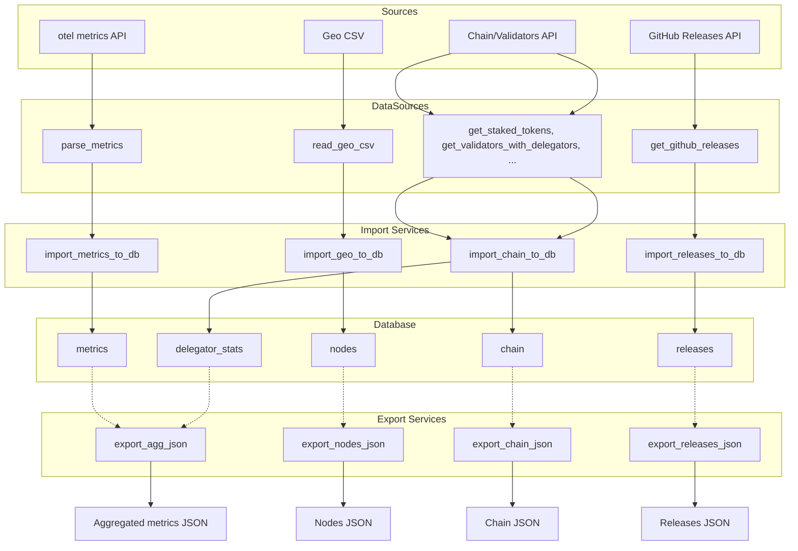
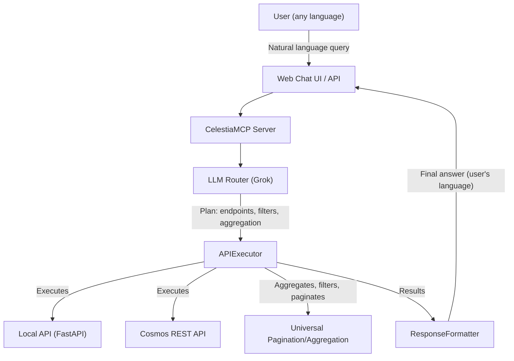

# CelestiaBridge

## Project Description

CelestiaBridge is a modular backend platform for collecting, processing, aggregating, and exporting analytical data about the Celestia network. The system automatically gathers metrics from various sources (otel metrics, APIs, CSV, GitHub), normalizes and stores them in a structured database, and provides a unified CLI for import, export, and analytics. The main goal is to provide a single point of data collection and preparation for dashboards, monitoring, research, and analytics automation for Celestia.

**Key Features:**
- Collects metrics from otel metrics, APIs, CSV, GitHub Releases
- Unified pipeline for data processing and normalization
- Stores data in a structured database (PostgreSQL/SQLite)
- Aggregation and export to JSON for dashboards/BI/analytics
- **Multilingual support (11 languages)**
- **Real-time data analysis through natural language queries**
- Convenient CLI for import, export, and data viewing
- Flexible configuration via `.env` and `config/`
- Modular, clean, and testable codebase
- All docstrings and comments are in English
- All dependencies are managed via `requirements.txt`
- All error handling via try/except and logging
- All data models are in `models/`

**Intended Users:**
- Developers, analysts, DevOps, Celestia dashboard operators
- Anyone who needs to automatically collect, store, and analyze Celestia network data

---

## Quick Start

1. Create and activate a virtual environment:
   ```bash
   python -m venv venv
   source venv/bin/activate  # or venv\Scripts\activate for Windows
   ```
2. Install dependencies:
   ```bash
   pip install -r requirements.txt
   ```
3. Copy `.env.example` to `.env` and edit as needed.

### CLI

```bash
python main.py --help
```

---

## CLI Usage

CelestiaBridge provides a unified CLI for importing, exporting, and viewing data. All commands are run as:

```bash
python main.py <command> [options]
```

### CLI Command Reference

- **init_db** — Initialize the database and create all required tables.
  - Example: `python main.py init_db`

- **import_geo** — Import geo-csv into the `nodes` table (updates node geoinfo).
  - Example: `python main.py import_geo`

- **import_metrics** — Import otel metrics into the `metrics` table.
  - Example: `python main.py import_metrics`

- **import_chain** — Import chain metrics (stake, delegators, inflation, etc.) into the `chain` table.
  - Example: `python main.py import_chain`

- **import_releases** — Import releases from GitHub into the `releases` table.
  - Example: `python main.py import_releases`

- **show_table <table>** — Show the first 10 records from the selected table (`nodes`, `metrics`, `chain`, `releases`, `delegator_stats`).
  - Example: `python main.py show_table nodes`

- **export_agg <metric_name> [--hours N] [--out FILE]** — Export an aggregated metric (e.g., latency) for the specified period to JSON.
  - Example: `python main.py export_agg latency --hours 48 --out latency_agg.json`

- **export_releases [--out FILE]** — Export all releases to JSON.
  - Example: `python main.py export_releases --out releases.json`

- **export_chain [--out FILE] [--limit N]** — Export chain metrics to JSON (legacy format).
  - Example: `python main.py export_chain --out chain.json --limit 50`

- **export_nodes [--out FILE]** — Export all nodes to JSON.
  - Example: `python main.py export_nodes --out nodes.json`

#### Help
To see all available commands and options:
```bash
python main.py --help
python main.py <command> --help
```

---

## Project Structure

- `data_sources/` — Modules for reading/parsing raw data (otel metrics, CSV, APIs)
- `models/` — Data models (`Node`, `Chain`, `Metric`, `Release`, etc.)
- `services/` — Business logic, integration, data merging, import/export to DB
- `celestia_mcp/` — MCP/AI assistant: LLM router, API registry, executor, response formatter, web chat API, Grok integration
    - `core/` — Core logic for endpoint discovery, LLM routing, execution, formatting
    - `web_chat_api.py` — Minimal FastAPI web chat for testing the assistant
    - `mcp_server.py` — Main MCP server class
    - `grok_llm_client.py` — Grok LLM API integration
- `config.py` — Main configuration file (project root)
- `config/` — Additional config files (optional, e.g. for environments)
- `.env` — Environment variables (API keys, DB connection, etc.)
- `main.py` — Entry point, CLI
- `README.md` — Project documentation
- `requirements.txt` — Python dependencies
- `.gitignore` — Git ignore rules

---

## Database Tables Structure

- **nodes**: Information about network nodes, including geo-location and metadata.
- **metrics**: Time-series metrics collected from otel metrics and other sources.
- **chain**: Chain-level metrics (stake, delegators, inflation, etc.).
- **releases**: GitHub release data for Celestia software.
- **delegator_stats**: Detailed statistics about delegators and their activity.

### Database Utility: check_db.py

The `check_db.py` utility prints the list of tables in the current database and shows the number of records in each main table (`nodes`, `metrics`, `chain`, `releases`).

**Usage:**
```bash
python check_db.py
```

---

## Data Flow Diagram



---

## Architectural Principles

- All logic for reading, parsing, and normalizing raw data (otel metrics, CSV, APIs) is in `data_sources/`.
- All parsers have a unified interface: return `list[dict]` or `dict`, handle errors via try/except and logging.
- No hardcoded paths, keys, or constants — everything is managed via `config.py` and environment variables.
- All business logic, aggregation, and integration is in `services/`.
- All data models (`Node`, `Chain`, `Metric`, `Release`, etc.) are in `models/`.
- All dependencies are managed only via `requirements.txt`.
- All documentation and docstrings are in English.
- All error handling is performed via try/except and logging. Critical errors are logged but do not crash the pipeline (except for unrecoverable network errors).
- All configuration is handled via `.env` and `config.py`.
- The codebase is modular, clean, and testable.
- The legacy `context/` folder is not used in the new implementation.

---

## Error Handling & Logging

- All data reading/parsing functions in `data_sources/` use try/except and log errors, warnings, and info using the standard `logging` module.
- All critical errors are logged. The pipeline continues unless an unrecoverable error occurs (e.g., network fetch failure).
- No hardcoded variables; all configuration is via `.env` and `config.py`.

---

## Dependencies

All dependencies are managed via `requirements.txt`. Main dependencies include:
- SQLAlchemy
- requests
- python-dotenv
- pycountry
- pycountry-convert
- pandas
- pydantic
- click
- pytest
- logging (standard library)

---

## Usage Scenario

**Example:**
A DevOps engineer wants to automate the collection and aggregation of Celestia network metrics for a dashboard. They configure `.env`, run `python main.py import_metrics` and `python main.py export_agg latency --hours 24 --out latency.json`, and use the resulting JSON in their dashboard.

---

## API (FastAPI)

CelestiaBridge provides an open HTTP API to access all output data in JSON format.

### API Launch

1. Install dependencies:
   ```bash
   pip install -r requirements.txt
   ```
2. Start the server:
   ```bash
   uvicorn api_main:app --reload
   ```
   The API will be available at http://127.0.0.1:8000

### Documentation
- Swagger UI: http://127.0.0.1:8000/docs
- OpenAPI JSON: http://127.0.0.1:8000/openapi.json

### Main Endpoints
- `GET /nodes` — list of nodes (with pagination)
- `GET /chain` — chain metrics (with pagination)
- `GET /metrics/aggregate?metric_name=...&hours=...` — aggregated metrics
- `GET /releases` — releases (with pagination)
- `GET /health` — API health check

#### Pagination Parameters
- `skip` — how many records to skip (default: 0)
- `limit` — how many records to return (default: 100, max: 1000)

#### Example Request
```bash
curl "http://127.0.0.1:8000/nodes?skip=0&limit=10"
```

---

## AI Assistant (MCP)

### How to Run the Assistant (MCP/Web Chat)

```bash
# 1. Start the local API (on a separate port, e.g., 8001)
uvicorn api_main:app --port 8001

# 2. Start the MCP server (assistant)
uvicorn celestia_mcp.web_chat_api:app --reload --port 8000
```
- The MCP server will be available at http://127.0.0.1:8000
- Web chat for testing: http://127.0.0.1:8000

### Capabilities
- Accepts natural language queries in any language (automatic language detection).
- Supports analytical queries: filtering, sorting, aggregation, top-N, unique values, sum, min/max, count.
- Works with both local API and Cosmos REST API, automatically selecting the required endpoint.
- Handles large paginated data (aggregation across all pages).
- Responds in the user's language, formats answers as paragraphs and lists, never hallucinates data.
- Supports query chaining (e.g., get block height → get block by height).

### How to Add New Endpoints/Queries
- Add a new function to `services/cosmos_api.py` or to FastAPI (`api_main.py`).
- For Cosmos REST API:
  - If the endpoint returns paginated data, add the attribute `is_pagination = True` to the function.
  - Describe parameters and response structure in the docstring in English.
- For local API:
  - Add the endpoint to FastAPI with a detailed English docstring.
- Optionally update documentation in `cosmos_api_summary.md`.
- The assistant will automatically discover new endpoints via the registry mechanism.

### Assistant Workflow Diagram



### Example: Complex Query

> "Show the top 5 delegators for validator X with a balance greater than 1,000,000 TIA"

- The LLM generates a plan: selects the endpoint, adds a filter, aggregation, and parameter substitution.
- The APIExecutor executes all steps, passing results between queries as needed.
- The answer is returned in a user-friendly format, in the user's language.

---

## License

MIT License 
